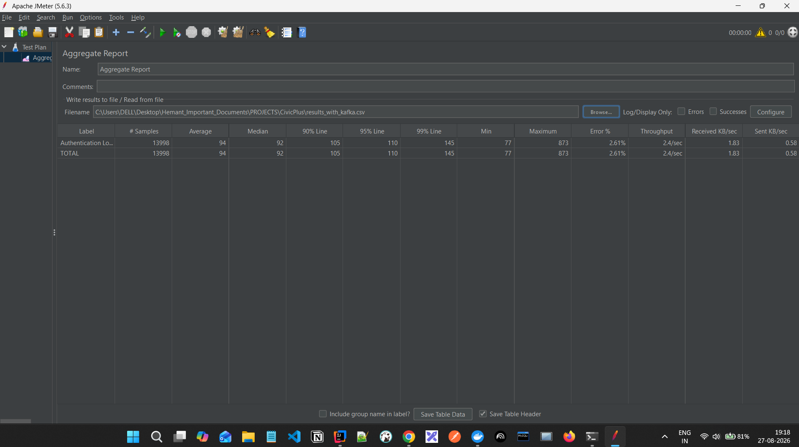
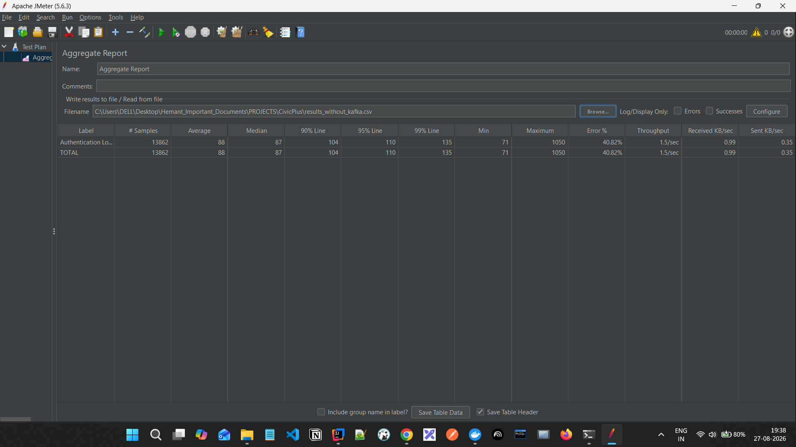

# CivicPlus

### A Scalable Microservices-Based Civic Grievance Management & Analytics Platform

**Java 21** · **Spring Boot 3.5.x** · **Spring Cloud** · **Apache Kafka** · **React 19** · **Vite 8** · **Docker** · **MySQL 8** · **Redis** · **MinIO**

---

## 📌 Executive Summary

**CivicPlus** is a scalable, distributed civic grievance management platform designed to digitize the complete lifecycle of citizen complaints — from registration and assignment to status updates, escalation, notifications, and analytics.

The platform follows a **Microservices Architecture** combined with **Event-Driven Architecture**, enabling individual business capabilities to evolve independently while communicating through a combination of:

* **Synchronous REST APIs** for request-response operations
* **Apache Kafka** for asynchronous event-driven communication
* **Eureka Service Discovery** for dynamic service registration and discovery
* **Spring Cloud Gateway** as the centralized API entry point
* **WebSocket + STOMP** for real-time complaint-status notifications
* **JWT-based stateless authentication**
* **Role-Based Access Control (RBAC)** at method level
* **MySQL** for persistent relational data
* **Redis** for caching-related workloads
* **MinIO** for object/file storage
* **Docker Compose** for local multi-service orchestration

The architecture is designed around **separation of concerns, loose coupling, scalability, resilience, and maintainability**.

---

# 🏗️ System Architecture

```mermaid
flowchart TD

subgraph group_client["Client & Edge"]
  node_frontend["React SPA<br/>Vite client<br/>[main.jsx]"]
  node_gateway{{"API Gateway<br/>Spring Cloud Gateway"}}
end

subgraph group_platform["Platform Services"]
  node_config["Config Server<br/>Spring Config"]
  node_discovery["Discovery Server<br/>Eureka"]
  node_auth["Auth Service<br/>identity service<br/>[AuthService.java]"]
  node_jwt["JWT Security<br/>per-service security<br/>[JwtAuthFilter.java]"]
  node_user["User Service<br/>profile service<br/>[UserService.java]"]
  node_department["Department Service<br/>organization service"]
  node_media["Media Service<br/>object media API"]
end

subgraph group_complaints["Complaint Lifecycle"]
  node_complaint_api["Complaint API<br/>REST controller"]
  node_complaint_app["Complaint Service<br/>application service"]
  node_complaint_data[("Complaint Data<br/>MySQL lifecycle schema")]
end

subgraph group_events["Events & Insights"]
  node_kafka["Kafka<br/>event stream"]
  node_notification["Notification Service<br/>event consumer"]
  node_websocket["STOMP/WebSocket<br/>realtime delivery"]
  node_analytics["Analytics Service<br/>event consumer"]
  node_analytics_api["Analytics API<br/>dashboard REST API"]
end

subgraph group_infra["Runtime Infrastructure"]
  node_compose["Docker Compose<br/>local runtime<br/>[docker-compose.yml]"]
  node_minio[("MinIO<br/>object storage")]
end

node_compose -->|"starts"| node_gateway
node_compose -->|"provisions"| node_kafka
node_compose -->|"provisions"| node_minio
node_frontend -->|"REST API"| node_gateway
node_frontend -->|"realtime updates"| node_websocket
node_gateway -->|"routes"| node_auth
node_gateway -->|"routes"| node_complaint_api
node_gateway -->|"routes"| node_user
node_gateway -->|"routes"| node_department
node_gateway -->|"routes"| node_media
node_gateway -->|"routes"| node_analytics_api
node_config -.->|"central config"| node_gateway
node_config -.->|"central config"| node_complaint_app
node_discovery -.->|"service discovery"| node_gateway
node_discovery -.->|"registers"| node_complaint_app
node_auth -->|"issues tokens"| node_jwt
node_jwt -.->|"protects"| node_complaint_api
node_complaint_api -->|"lifecycle commands"| node_complaint_app
node_complaint_app -->|"persists"| node_complaint_data
node_complaint_app -.->|"profile lookup"| node_user
node_complaint_app -.->|"officer assignment"| node_department
node_media -->|"stores objects"| node_minio
node_complaint_app -->|"publishes lifecycle events"| node_kafka
node_kafka -->|"consumes events"| node_notification
node_notification -->|"pushes notifications"| node_websocket
node_kafka -->|"consumes events"| node_analytics
node_analytics -->|"serves statistics"| node_analytics_api

click node_compose "[https://github.com/hemantmishra-lab/civicplus-microservices/blob/main/docker-compose.yml](https://github.com/hemantmishra-lab/civicplus-microservices/blob/main/docker-compose.yml)"
click node_frontend "[https://github.com/hemantmishra-lab/civicplus-microservices/blob/main/frontend/src/main.jsx](https://github.com/hemantmishra-lab/civicplus-microservices/blob/main/frontend/src/main.jsx)"
click node_gateway "[https://github.com/hemantmishra-lab/civicplus-microservices/blob/main/api-gateway/src/main/java/com/hemant/civicplus/apigateway/ApiGatewayApplication.java](https://github.com/hemantmishra-lab/civicplus-microservices/blob/main/api-gateway/src/main/java/com/hemant/civicplus/apigateway/ApiGatewayApplication.java)"
click node_config "[https://github.com/hemantmishra-lab/civicplus-microservices/blob/main/config-server/src/main/java/com/hemant/civicplus/configserver/ConfigServerApplication.java](https://github.com/hemantmishra-lab/civicplus-microservices/blob/main/config-server/src/main/java/com/hemant/civicplus/configserver/ConfigServerApplication.java)"
click node_discovery "[https://github.com/hemantmishra-lab/civicplus-microservices/blob/main/discovery-server/src/main/java/com/hemant/civicplus/discoveryserver/DiscoveryServerApplication.java](https://github.com/hemantmishra-lab/civicplus-microservices/blob/main/discovery-server/src/main/java/com/hemant/civicplus/discoveryserver/DiscoveryServerApplication.java)"
click node_auth "[https://github.com/hemantmishra-lab/civicplus-microservices/blob/main/auth-service/src/main/java/com/hemant/civicplus/authservice/application/AuthService.java](https://github.com/hemantmishra-lab/civicplus-microservices/blob/main/auth-service/src/main/java/com/hemant/civicplus/authservice/application/AuthService.java)"
click node_jwt "[https://github.com/hemantmishra-lab/civicplus-microservices/blob/main/complaint-service/src/main/java/com/hemant/civicplus/complaintservice/security/JwtAuthFilter.java](https://github.com/hemantmishra-lab/civicplus-microservices/blob/main/complaint-service/src/main/java/com/hemant/civicplus/complaintservice/security/JwtAuthFilter.java)"
click node_user "[https://github.com/hemantmishra-lab/civicplus-microservices/blob/main/user-service/src/main/java/com/hemant/civicplus/userservice/application/UserService.java](https://github.com/hemantmishra-lab/civicplus-microservices/blob/main/user-service/src/main/java/com/hemant/civicplus/userservice/application/UserService.java)"
click node_department "[https://github.com/hemantmishra-lab/civicplus-microservices/blob/main/department-service/src/main/java/com/hemant/civicplus/departmentservice/application/DepartmentService.java](https://github.com/hemantmishra-lab/civicplus-microservices/blob/main/department-service/src/main/java/com/hemant/civicplus/departmentservice/application/DepartmentService.java)"
click node_media "[https://github.com/hemantmishra-lab/civicplus-microservices/blob/main/media-service/src/main/java/com/hemant/civicplus/mediaservice/controller/MediaController.java](https://github.com/hemantmishra-lab/civicplus-microservices/blob/main/media-service/src/main/java/com/hemant/civicplus/mediaservice/controller/MediaController.java)"
click node_complaint_api "[https://github.com/hemantmishra-lab/civicplus-microservices/blob/main/complaint-service/src/main/java/com/hemant/civicplus/complaintservice/controller/ComplaintController.java](https://github.com/hemantmishra-lab/civicplus-microservices/blob/main/complaint-service/src/main/java/com/hemant/civicplus/complaintservice/controller/ComplaintController.java)"
click node_complaint_app "[https://github.com/hemantmishra-lab/civicplus-microservices/blob/main/complaint-service/src/main/java/com/hemant/civicplus/complaintservice/application/ComplaintService.java](https://github.com/hemantmishra-lab/civicplus-microservices/blob/main/complaint-service/src/main/java/com/hemant/civicplus/complaintservice/application/ComplaintService.java)"
click node_complaint_data "[https://github.com/hemantmishra-lab/civicplus-microservices/blob/main/complaint-service/src/main/resources/db/migration/V1__init_complaint_schema.sql](https://github.com/hemantmishra-lab/civicplus-microservices/blob/main/complaint-service/src/main/resources/db/migration/V1__init_complaint_schema.sql)"
click node_notification "[https://github.com/hemantmishra-lab/civicplus-microservices/blob/main/notification-service/src/main/java/com/hemant/civicplus/notificationservice/kafka/ComplaintEventListener.java](https://github.com/hemantmishra-lab/civicplus-microservices/blob/main/notification-service/src/main/java/com/hemant/civicplus/notificationservice/kafka/ComplaintEventListener.java)"
click node_websocket "[https://github.com/hemantmishra-lab/civicplus-microservices/blob/main/notification-service/src/main/java/com/hemant/civicplus/notificationservice/config/WebSocketConfig.java](https://github.com/hemantmishra-lab/civicplus-microservices/blob/main/notification-service/src/main/java/com/hemant/civicplus/notificationservice/config/WebSocketConfig.java)"
click node_analytics "[https://github.com/hemantmishra-lab/civicplus-microservices/blob/main/analytics-service/src/main/java/com/hemant/civicplus/analyticsservice/kafka/ComplaintEventConsumer.java](https://github.com/hemantmishra-lab/civicplus-microservices/blob/main/analytics-service/src/main/java/com/hemant/civicplus/analyticsservice/kafka/ComplaintEventConsumer.java)"
click node_analytics_api "[https://github.com/hemantmishra-lab/civicplus-microservices/blob/main/analytics-service/src/main/java/com/hemant/civicplus/analyticsservice/controller/AnalyticsController.java](https://github.com/hemantmishra-lab/civicplus-microservices/blob/main/analytics-service/src/main/java/com/hemant/civicplus/analyticsservice/controller/AnalyticsController.java)"

classDef toneNeutral fill:#f8fafc,stroke:#334155,stroke-width:1.5px,color:#0f172a;
classDef toneBlue fill:#dbeafe,stroke:#2563eb,stroke-width:1.5px,color:#172554;
classDef toneAmber fill:#fef3c7,stroke:#d97706,stroke-width:1.5px,color:#78350f;
classDef toneMint fill:#dcfce7,stroke:#16a34a,stroke-width:1.5px,color:#14532d;
classDef toneRose fill:#ffe4e6,stroke:#e11d48,stroke-width:1.5px,color:#881337;
classDef toneIndigo fill:#e0e7ff,stroke:#4f46e5,stroke-width:1.5px,color:#312e81;
classDef toneTeal fill:#ccfbf1,stroke:#0f766e,stroke-width:1.5px,color:#134e4a;

class node_frontend,node_gateway toneBlue;
class node_config,node_discovery,node_auth,node_jwt,node_user,node_department,node_media toneAmber;
class node_complaint_api,node_complaint_app,node_complaint_data toneMint;
class node_kafka,node_notification,node_websocket,node_analytics,node_analytics_api toneRose;
class node_compose,node_minio toneIndigo;
```




```text
                         ┌──────────────────────────┐
                         │        React 19           │
                         │     Vite 8 Frontend       │
                         └────────────┬─────────────┘
                                      │
                              HTTP / REST / WS
                                      │
                                      ▼
                    ┌─────────────────────────────────┐
                    │       Spring Cloud Gateway      │
                    │            :8080                │
                    │                                 │
                    │ Authentication / Routing / LB    │
                    └───────────────┬─────────────────┘
                                    │
                         Eureka Service Discovery
                                    │
          ┌─────────────────────────┼──────────────────────────┐
          │                         │                          │
          ▼                         ▼                          ▼
 ┌────────────────┐       ┌─────────────────┐       ┌─────────────────┐
 │  Auth Service  │       │  User Service   │       │ Complaint       │
 │                │       │                 │       │ Service         │
 └───────┬────────┘       └────────┬────────┘       └────────┬────────┘
         │                         │                         │
         │                         │                         │
         ▼                         ▼                         ▼
      MySQL                    MySQL                      MySQL
                                                            │
                                                            │
                                                            ▼
                                                   ┌────────────────┐
                                                   │ Apache Kafka   │
                                                   │                │
                                                   │ complaint-     │
                                                   │ events         │
                                                   └───────┬────────┘
                                                           │
                                      ┌────────────────────┼───────────────────┐
                                      │                    │                   │
                                      ▼                    ▼                   ▼
                              ┌───────────────┐    ┌───────────────┐   ┌───────────────┐
                              │ Notification  │    │   Analytics   │   │ Other Kafka   │
                              │   Service     │    │   Service     │   │ Consumers     │
                              └───────┬───────┘    └───────────────┘   └───────────────┘
                                      │
                                      │ STOMP / WebSocket
                                      ▼
                              ┌────────────────┐
                              │ Real-Time Push  │
                              │ Notifications   │
                              └────────────────┘


       ┌──────────────────┐          ┌──────────────────┐
       │ Department       │          │ Media Service    │
       │ Service          │          │                  │
       └────────┬─────────┘          └────────┬─────────┘
                │                             │
              MySQL                         MinIO
                                            Object Store


       ┌──────────────────┐
       │ Redis            │
       │ Cache            │
       └──────────────────┘


       ┌────────────────────────────────────────────────────┐
       │              Eureka Discovery Server               │
       │                      :8761                          │
       └────────────────────────────────────────────────────┘
```

---

# 🔄 Request & Event Flow

A typical complaint lifecycle follows this flow:

```text
Citizen
   │
   ▼
React Frontend
   │
   │ POST /api/v1/complaints
   ▼
API Gateway
   │
   │ Service Discovery
   ▼
Complaint Service
   │
   ├──────────────► MySQL
   │
   └──────────────► Kafka
                       │
                       │ complaint-events
                       ▼
              Notification Service
                       │
                       ├──► Persist Notification
                       │
                       └──► WebSocket/STOMP
                                  │
                                  ▼
                            Citizen / Officer
```

This separation allows complaint processing to remain independent from notification and analytics workloads.

---

# 🧩 Microservices

| Service                  | Responsibility                                        | Default Port |
| ------------------------ | ----------------------------------------------------- | -----------: |
| **Config Server**        | Centralized configuration management                  |       `8888` |
| **Discovery Server**     | Eureka service registration & discovery               |       `8761` |
| **API Gateway**          | Central API entry point and routing                   |       `8080` |
| **Auth Service**         | Registration, login, OTP and password flows           |       `8081` |
| **User Service**         | Citizen/officer profile management                    |       `8082` |
| **Complaint Service**    | Complaint creation, assignment, status and escalation |       `8083` |
| **Department Service**   | Departments and officer management                    |       `8084` |
| **Media Service**        | File upload/download using MinIO                      |       `8085` |
| **Notification Service** | Notifications, Kafka consumption and WebSockets       |       `8086` |
| **Analytics Service**    | Complaint metrics and dashboard analytics             |       `8087` |

---

# 🛠️ Tech Stack

| Category              | Technology                          |
| --------------------- | ----------------------------------- |
| Language              | Java 21                             |
| Backend Framework     | Spring Boot 3.5.x                   |
| Cloud / Microservices | Spring Cloud 2025.x                 |
| Service Discovery     | Netflix Eureka                      |
| API Gateway           | Spring Cloud Gateway                |
| Communication         | REST + Kafka                        |
| Messaging             | Apache Kafka 3.7.x                  |
| Real-Time             | WebSocket + STOMP + SockJS          |
| Security              | Spring Security                     |
| Authentication        | Stateless JWT                       |
| Authorization         | Method-level RBAC / `@PreAuthorize` |
| ORM                   | Hibernate / Spring Data JPA         |
| Database              | MySQL 8.0                           |
| Cache                 | Redis 7                             |
| Object Storage        | MinIO                               |
| Database Migration    | Flyway                              |
| Frontend              | React 19                            |
| Frontend Language     | JSX / JavaScript                    |
| Build Tool            | Vite 8                              |
| Styling               | Tailwind CSS / Modern CSS           |
| HTTP Client           | Axios                               |
| State Management      | Redux Toolkit / React Redux         |
| Validation            | React Hook Form / Zod               |
| Charts                | Recharts                            |
| Containerization      | Docker                              |
| Orchestration         | Docker Compose                      |
| Build System          | Maven                               |
| CI/CD                 | GitHub Actions                      |

> **Repository accuracy note:** The current implementation uses **MySQL 8.0**, not PostgreSQL, and the Maven project is configured for **Java 21**, not Java 17. Redis and MinIO are also part of the current Docker Compose environment.

---

# 🚀 Key Features & Capabilities

## 1. Microservices Architecture

CivicPlus decomposes the application into independently deployable business services.

Each service owns a specific responsibility, reducing coupling and making the platform easier to:

* Develop
* Test
* Deploy
* Scale
* Maintain
* Extend

---

## 2. Eureka Service Discovery

Services register themselves with the **Eureka Discovery Server**.

```text
Service
   │
   │ register
   ▼
Eureka Server
   │
   │ discover
   ▼
Other Services / Gateway
```

This avoids hard-coding service locations and supports dynamic service discovery.

---

## 3. API Gateway

The **Spring Cloud Gateway** acts as the perimeter entry point.

Example routing:

```text
/api/v1/auth/**          → auth-service
/api/v1/users/**         → user-service
/api/v1/complaints/**    → complaint-service
/api/v1/media/**         → media-service
/api/v1/departments/**   → department-service
/api/v1/notifications/** → notification-service
/api/v1/analytics/**     → analytics-service
```

Gateway routes use Eureka-aware load-balanced service identifiers such as:

```text
lb://complaint-service
```

---

## 4. Event-Driven Architecture with Kafka

Complaint lifecycle changes can generate events through the Kafka topic:

```text
complaint-events
```

The architecture separates the producer from downstream consumers:

```text
Complaint Service
       │
       │ Publish Event
       ▼
 Kafka: complaint-events
       │
       ├──────────────► Notification Service
       │
       └──────────────► Analytics Service
```

This prevents the complaint service from becoming tightly coupled to notification and analytics processing.


### 📊 Performance Validation: Kafka Load Testing (JMeter)

To validate system resilience under peak concurrency, stress testing was executed using **Apache JMeter** across **14,000+ requests**. The benchmark compares direct synchronous database operations against asynchronous event streaming via Kafka.

| Benchmark Metric | Without Kafka (Direct DB Writes) | With Kafka Event Streaming | Impact / Metric Gain |
| :--- | :---: | :---: | :---: |
| **Error Rate (Failures)** | `40.82%` | **`2.61%`** | **93.6% Error Reduction** |
| **Throughput (Capacity)** | `1.5 req/sec` | **`2.4 req/sec`** | **+60.0% Throughput Gain** |
| **Peak Max Latency** | `1050 ms` | **`873 ms`** | **16.9% Lower Tail Latency** |
| **Data Rate (Received)** | `0.99 KB/sec` | **`1.83 KB/sec`** | **+84.8% Transfer Capacity** |

#### JMeter Execution Benchmarks

**1. Without Kafka (Database Connection Overload & Failure Spikes)**

> *Without Kafka, direct synchronous persistence caused severe thread contention, resulting in a **40.82% error rate** under high load.*

**2. With Kafka (Event-Buffered Asynchronous Streaming)**

> *By decoupling ingestion via Kafka queues, the backend safely handled peak stress—slashing errors to **2.61%** while increasing throughput by **60%**.*
---

## 5. Real-Time Notifications

Notification Service integrates:

* Spring WebSocket
* STOMP
* SockJS
* Kafka
* `SimpMessagingTemplate`

When a complaint event is consumed, the notification service can publish updates to user-specific destinations.

Example:

```text
/topic/status/{citizenId}
```

Assigned officers can also receive complaint-status updates through their user-specific topic.

---

## 6. JWT Authentication

CivicPlus uses stateless JWT-based authentication.

Conceptually:

```text
Login
  │
  ▼
Auth Service
  │
  ▼
JWT Token
  │
  ▼
Frontend
  │
  │ Authorization: Bearer <token>
  ▼
API Gateway / Microservice
  │
  ▼
JWT Validation
  │
  ▼
Authorized Request
```

No server-side session is required for normal authentication state.

---

## 7. Role-Based Access Control

Authorization can be applied at method level using Spring Security annotations such as:

```java
@PreAuthorize(...)
```

This enables granular permissions based on application roles and protects sensitive operations.

---

## 8. Complaint Lifecycle Management

The complaint service supports operations such as:

```text
Create Complaint
      ↓
Assignment
      ↓
Status Updates
      ↓
Escalation
      ↓
Resolution
      ↓
History / Analytics
```

The platform maintains complaint history and supports citizen/officer-specific complaint views.

---

## 9. Analytics

Analytics Service exposes dashboard-oriented complaint statistics.

The analytics layer can aggregate information such as:

* Complaint counts
* Complaint status distribution
* Resolution metrics
* Dashboard statistics

Transactional service boundaries help maintain consistency during database operations.

---

## 10. Media Management

The Media Service integrates **MinIO** for object storage.

Supported operations include:

```text
Upload File
     ↓
MinIO Bucket
     ↓
Download File
```

The default bucket configured in the project is:

```text
civicplus-bucket
```

---

## 11. Redis

Redis is included in the Docker Compose infrastructure and is configured for the complaint-service environment.

It provides an infrastructure layer for cache-oriented workloads and can reduce repeated database access for suitable operations.

---

# 📡 REST API Reference

All public API routes are exposed through the API Gateway on:

```text
http://localhost:8080
```

## Authentication

| Method | Endpoint                       | Purpose                 |
| ------ | ------------------------------ | ----------------------- |
| `POST` | `/api/v1/auth/register`        | Register user           |
| `POST` | `/api/v1/auth/verify-account`  | Verify account          |
| `POST` | `/api/v1/auth/login`           | Authenticate user       |
| `POST` | `/api/v1/auth/forgot-password` | Start password recovery |
| `POST` | `/api/v1/auth/verify-otp`      | Verify OTP              |
| `POST` | `/api/v1/auth/reset-password`  | Reset password          |

---

## Complaints

| Method | Endpoint                           | Purpose                    |
| ------ | ---------------------------------- | -------------------------- |
| `POST` | `/api/v1/complaints`               | Create complaint           |
| `GET`  | `/api/v1/complaints/citizen`       | Get citizen complaints     |
| `GET`  | `/api/v1/complaints/assigned`      | Get assigned complaints    |
| `GET`  | `/api/v1/complaints/internal/all`  | Internal complaint listing |
| `GET`  | `/api/v1/complaints/{id}`          | Get complaint              |
| `GET`  | `/api/v1/complaints/{id}/history`  | Get complaint history      |
| `PUT`  | `/api/v1/complaints/{id}/status`   | Update complaint status    |
| `PUT`  | `/api/v1/complaints/{id}/escalate` | Escalate complaint         |
| `PUT`  | `/api/v1/complaints/{id}/assign`   | Assign complaint           |

---

## User Profile

| Method | Endpoint                               | Purpose              |
| ------ | -------------------------------------- | -------------------- |
| `GET`  | `/api/v1/users/profile`                | Get current profile  |
| `PUT`  | `/api/v1/users/profile`                | Update profile       |
| `GET`  | `/api/v1/users/profile/nearest`        | Find nearest officer |
| `GET`  | `/api/v1/users/profile/internal/count` | Get user count       |
| `POST` | `/api/v1/users/profile/avatar`         | Upload avatar        |

---

## Departments

| Method | Endpoint                                | Purpose                |
| ------ | --------------------------------------- | ---------------------- |
| `POST` | `/api/v1/departments`                   | Create department      |
| `GET`  | `/api/v1/departments`                   | List departments       |
| `PUT`  | `/api/v1/departments/{id}/assign-head`  | Assign department head |
| `POST` | `/api/v1/departments/officers`          | Add officer            |
| `GET`  | `/api/v1/departments/officers/{userId}` | Get officer details    |

---

## Notifications

| Method | Endpoint                | Purpose                          |
| ------ | ----------------------- | -------------------------------- |
| `GET`  | `/api/v1/notifications` | Get current user's notifications |

---

## Analytics

| Method | Endpoint                      | Purpose                      |
| ------ | ----------------------------- | ---------------------------- |
| `GET`  | `/api/v1/analytics/dashboard` | Retrieve dashboard analytics |

---

## Media

| Method | Endpoint                            | Purpose        |
| ------ | ----------------------------------- | -------------- |
| `POST` | `/api/v1/media/upload`              | Upload media   |
| `GET`  | `/api/v1/media/download/{fileName}` | Download media |

---

# 🔌 WebSocket / STOMP

Notification Service exposes the STOMP WebSocket endpoint:

```text
/api/v1/notifications/ws-complaints
```

SockJS is enabled for client compatibility.

### Broker Prefix

```text
/topic
```

### Application Prefix

```text
/app
```

### Complaint Status Destination

```text
/topic/status/{userId}
```

For example:

```text
/topic/status/42
```

A citizen or assigned officer can subscribe to their corresponding status channel to receive real-time complaint updates.

---

# 📨 Kafka

## Topic

```text
complaint-events
```

### Event Flow

```text
Complaint Service
       │
       │ Complaint Event
       ▼
Kafka Broker
       │
       ▼
complaint-events
       │
       ├───────────────► Notification Service
       │
       └───────────────► Analytics Service
```

### Why Kafka?

Kafka provides:

* Asynchronous processing
* Loose coupling
* Independent consumers
* Event replay capabilities
* Better scalability
* Decoupled notification and analytics processing

---

# 🗄️ Data & Infrastructure

The current Docker Compose environment contains:

```text
MySQL
Redis
Kafka
MinIO
Eureka
Config Server
API Gateway
Backend Microservices
React Frontend
```

### MySQL

The services use separate logical databases such as:

```text
auth_db
user_db
complaint_db
department_db
notification_db
analytics_db
```

### Redis

```text
localhost:6379
```

### Kafka

Host access:

```text
localhost:29092
```

Container-network access:

```text
kafka:9092
```

### MinIO

API:

```text
localhost:9000
```

Console:

```text
localhost:9001
```

---

# 📋 Prerequisites

Before running CivicPlus locally, install:

* Java 21
* Maven or Maven Wrapper
* Node.js 20+
* npm
* Docker Desktop
* Docker Compose
* Git

Verify:

```bash
java -version
node --version
npm --version
docker --version
docker compose version
```

---

# ⚙️ Installation & Setup

## Option 1 — Recommended: Docker Compose

Clone the repository:

```bash
git clone https://github.com/Hemantmishra-lab/civicplus-microservices.git
cd civicplus-microservices-main
```

Start the complete infrastructure:

```bash
docker compose up --build
```

For detached mode:

```bash
docker compose up --build -d
```

Check running containers:

```bash
docker compose ps
```

View logs:

```bash
docker compose logs -f
```

View logs for a particular service:

```bash
docker compose logs -f complaint-service
```

Stop the platform:

```bash
docker compose down
```

Stop and remove persistent volumes:

```bash
docker compose down -v
```

> `down -v` removes Docker volumes containing persistent database/cache/object-storage data.

---

# 🖥️ Backend — Manual Development Setup

If you want to run backend services outside Docker:

### 1. Start infrastructure

Start the required infrastructure services:

```bash
docker compose up mysql redis kafka minio
```

### 2. Build the Maven project

Linux/macOS:

```bash
./mvnw clean package
```

Windows:

```powershell
.\mvnw.cmd clean package
```

### 3. Start services in dependency order

A practical order is:

```text
Config Server
      ↓
Discovery Server
      ↓
Auth / User / Complaint / Department / Media
      ↓
Notification / Analytics
      ↓
API Gateway
```

The exact service startup strategy can vary depending on the local configuration.

---

# 🌐 Frontend Setup

Navigate to the frontend:

```bash
cd frontend
```

Install dependencies:

```bash
npm install
```

Start the Vite development server:

```bash
npm run dev
```

Create production build:

```bash
npm run build
```

Preview production build:

```bash
npm run preview
```

Lint the project:

```bash
npm run lint
```

---

# 🐳 Docker Architecture

The repository contains Dockerfiles for the backend services and frontend.

A simplified deployment model:

```text
                 Docker Compose
                       │
     ┌─────────────────┼─────────────────┐
     │                 │                 │
     ▼                 ▼                 ▼
 Infrastructure    Spring Cloud       Frontend
     │              Services              │
     │                 │                  │
 ┌───┼────┐      ┌─────┼─────┐           │
 │   │    │      │     │     │           │
MySQL Redis Kafka Eureka Gateway       React
             │       │
             │       └── API Routing
             │
             └── Event Streaming
```

---

# 🔄 CI/CD Pipeline

CivicPlus includes a GitHub Actions workflow:

```text
.github/workflows/ci.yml
```

The pipeline performs:

```text
Git Push / Pull Request
          │
          ▼
     Checkout Code
          │
          ▼
      Setup JDK 21
          │
          ▼
    Maven Build
          │
          ▼
     Setup Node.js
          │
          ▼
   Frontend npm install
          │
          ▼
     Frontend Build
          │
          ▼
     Docker Buildx
          │
          ▼
    Docker Hub Login
          │
          ▼
    Build Docker Images
          │
          ▼
      Push Images
```

Docker Hub credentials are expected through GitHub Actions secrets:

```text
DOCKER_USERNAME
DOCKER_PASSWORD
```

---

# 📁 Repository Structure

```text
civicplus-microservices-main/
│
├── api-gateway/
├── auth-service/
├── user-service/
├── complaint-service/
├── department-service/
├── media-service/
├── notification-service/
├── analytics-service/
│
├── config-server/
├── discovery-server/
├── common-library/
│
├── frontend/
│
├── kubernetes/
│
├── .github/
│   └── workflows/
│       └── ci.yml
│
├── docker-compose.yml
├── pom.xml
└── README.md
```

---

# 🧠 Architectural Principles

CivicPlus demonstrates several enterprise software engineering principles:

### Separation of Concerns

Each service owns a focused business responsibility.

### Loose Coupling

Kafka reduces direct dependencies between complaint processing, notifications, and analytics.

### Service Discovery

Eureka eliminates the need for static service-location configuration between distributed services.

### API Gateway Pattern

Clients interact with a centralized gateway instead of directly communicating with every backend service.

### Stateless Authentication

JWT removes the need for centralized server-side HTTP sessions.

### Event-Driven Processing

Business events are published once and consumed independently by downstream services.

### Containerization

Docker packages application components and infrastructure into reproducible environments.

### Independent Scalability

Individual services can be scaled independently according to workload.

---

# 🧪 Development & Testing

Recommended development workflow:

```text
Feature Development
       ↓
Local Service Testing
       ↓
REST API Validation
       ↓
Kafka Event Validation
       ↓
WebSocket Validation
       ↓
Frontend Integration
       ↓
Maven Build
       ↓
Frontend Build
       ↓
Docker Build
       ↓
CI/CD
```

Useful commands:

```bash
./mvnw clean package
```

```bash
cd frontend
npm run build
```

```bash
docker compose up --build
```

---

# 🔐 Security Considerations

CivicPlus incorporates:

* JWT authentication
* Spring Security
* Stateless authentication
* Role-based authorization
* Method-level access control
* Gateway-level perimeter routing/security
* Protected service endpoints

For production deployment, secrets such as JWT keys, database passwords, MinIO credentials, and Docker credentials should be externalized using environment variables or a dedicated secrets-management solution.

---

# 📈 Scalability Model

CivicPlus can be horizontally scaled by increasing service replicas.

For example:

```text
                 API Gateway
                     │
          ┌──────────┼──────────┐
          ▼          ▼          ▼
     Complaint-1 Complaint-2 Complaint-3
          │          │          │
          └──────────┼──────────┘
                     ▼
                    Kafka
```

Eureka + load-balanced service discovery allows requests to be distributed among available service instances.

---

# 🗺️ Future Enhancements

Potential production-level improvements include:

* Kubernetes-based production deployment
* Centralized observability with OpenTelemetry
* Prometheus + Grafana monitoring
* Distributed tracing
* Circuit breakers with Resilience4j
* Kafka schema management
* Dead-letter topics
* Kafka retry strategies
* Centralized secret management
* PostgreSQL migration where required
* Automated integration testing
* Contract testing between microservices
* Production-grade ingress and TLS
* Rate limiting at API Gateway

---

# 📄 License

This project is licensed under the **MIT License**.

```text
MIT License

Copyright (c) 2026 Hemant Mishra

Permission is hereby granted, free of charge, to any person obtaining a copy
of this software and associated documentation files, to deal in the Software
without restriction, including without limitation the rights to use, copy,
modify, merge, publish, distribute, sublicense, and/or sell copies of the
Software, and to permit persons to whom the Software is furnished to do so,
subject to the following conditions:

The above copyright notice and this permission notice shall be included in
all copies or substantial portions of the Software.

THE SOFTWARE IS PROVIDED "AS IS", WITHOUT WARRANTY OF ANY KIND, EXPRESS OR
IMPLIED, INCLUDING BUT NOT LIMITED TO THE WARRANTIES OF MERCHANTABILITY,
FITNESS FOR A PARTICULAR PURPOSE AND NONINFRINGEMENT. IN NO EVENT SHALL THE
AUTHORS OR COPYRIGHT HOLDERS BE LIABLE FOR ANY CLAIM, DAMAGES OR OTHER
LIABILITY, WHETHER IN AN ACTION OF CONTRACT, TORT OR OTHERWISE, ARISING FROM,
OUT OF OR IN CONNECTION WITH THE SOFTWARE OR THE USE OR OTHER DEALINGS IN
THE SOFTWARE.
```

---

# 👨‍💻 Author

**Hemant Mishra**

CivicPlus demonstrates practical implementation of:

```text
Java
Spring Boot
Spring Cloud
Microservices
REST APIs
Kafka
WebSockets
JWT Security
Eureka
API Gateway
JPA / Hibernate
MySQL
Redis
MinIO
React
Docker
Docker Compose
GitHub Actions
Kubernetes
```

---

## ⭐ Project Summary

**CivicPlus is not simply a CRUD application.**

It demonstrates a complete distributed-system workflow:

```text
React Frontend
      ↓
API Gateway
      ↓
Eureka Service Discovery
      ↓
Independent Microservices
      ↓
MySQL / Redis / MinIO
      ↓
Kafka Event Bus
      ↓
Notification + Analytics
      ↓
WebSocket Real-Time Updates
      ↓
Citizen / Officer
```

The project provides a practical foundation for understanding **enterprise Java development, microservices architecture, event-driven systems, distributed communication, security, containerization, and CI/CD**.
